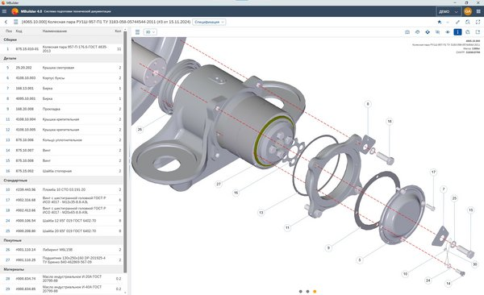
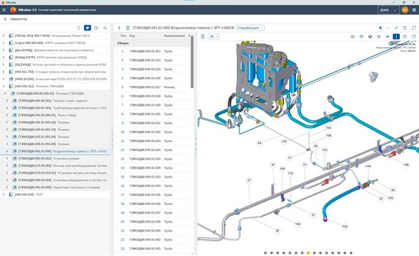
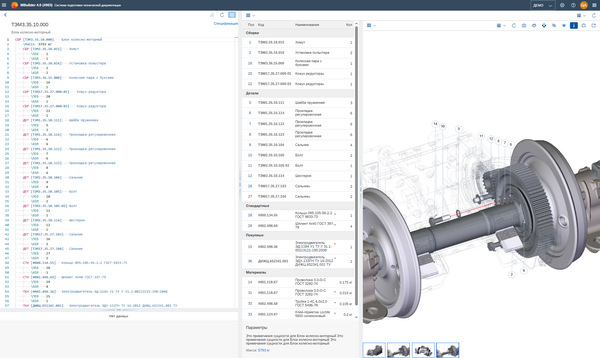
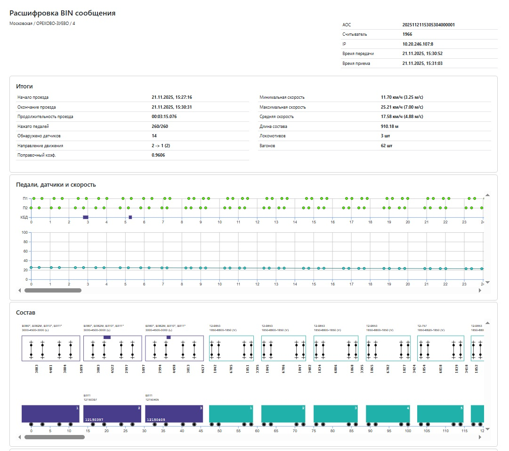
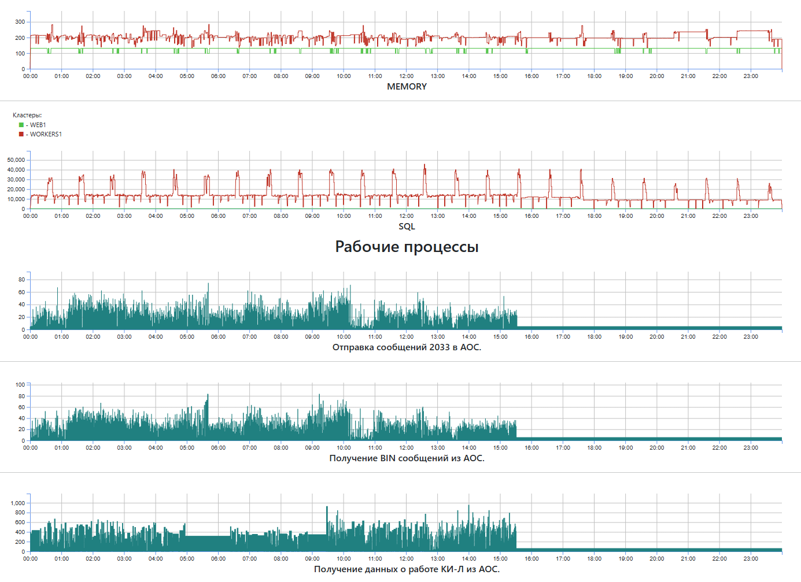
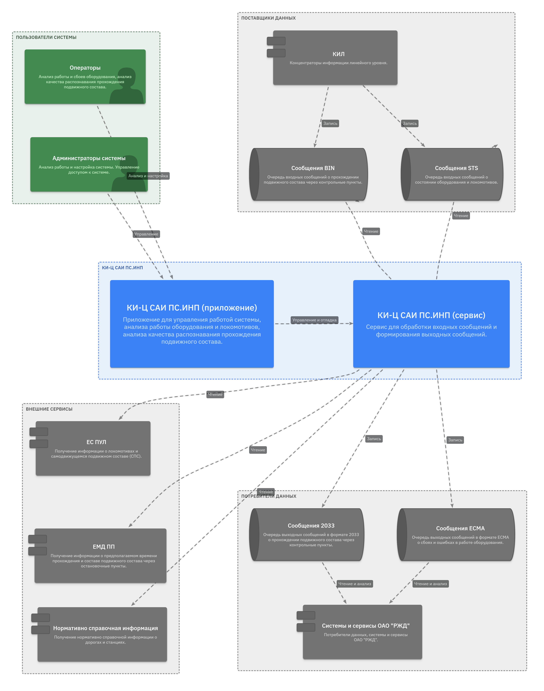

Панков Андрей Николаевич
Контакты
Телефон
+7 903 747-03-03
Почта
pankovan@yandex.ru
Телеграм
@apan388

Подзаголовок:
***Подборка внедрений по разным направлениям: высоконагруженные сервисы, 3D и веб-платформы, маршрутизация процессов и унификация работы с данными***

## MBuilder 

Платформа для создания интерактивных электронных технических руководств (ИЭТР). Контент интерактивных руководств разрабатывается на основе конструкторской, технологической и нормативной документации, включает в себя 3D интерактивный иерархический каталог деталей и узлов оборудования, снабженный подробной текстовой и графической информацией о вариантах исполнения, материалах, нормах допусков, технологическом процессе обслуживания и ремонта, оснастке и инструменте. 3D представление позволяет лучше понять конструкцию изделия и обеспечить наглядность работы ее узлов и деталей. MBuilder позволяет отображать данные, представленные в самых разных форматах: HTML, MD, PDF, XML, JSON, 3D (SMG, GLTF, STL, VRML), SVG, JPG, PNG, AVI и т.д.

**Роль:** 
Аналитик / Архитектор / TeamLead, начиная с 1-ой версии продукта, все это время проект успешно развивался, сейчас внедряется четвертая версия. Разрабатывал архитектуру, определял технологии и форматы данных, написал наиболее сложные части кода системы, в частности, обработку и отображение 3D. 

**Результат:**
Внедрение последней версии продукта позволило перейти от специального приложения к web, которое работает на любых браузерах и устройствах. Внедрил новые форматы 3D моделей, что позволило сократить объем последних от 20 до 100 раз без потери качества. Разработал новые встроенные редакторы взамен внешних, требовавших приобретения дополнительных лицензий.

**Стек:** Версия 4.0 – NODE JS, JavaScript, C#, Postgre SQL, Express, OpenUI5, Monaco Editor, 3D(GLTF), 2D(SVG), HTML, CSS.

Примеры экранов

Спецификация изделия и вид с разнесенными частями (3D)

Электронный каталог и с просмотром текущей сборки

Правка спецификации с предварительным просмотром результата

## КИ-Ц САИ ПС.ИНП

Концентратор информации центрального уровня предназначен для отслеживания в реальном времени прохождений 
железнодорожного подвижного состава через контрольные пункты. Сервис должен
- обеспечивать нагрузку более 100 000 проездов в сутки
- расшифровку и анализ сообщений о проездах с учетом возможных ошибок и неправильной настройки оборудования
- расшифровку и анализ сообщений о состояние специального оборудования
- получения дополнительной информации из смежных сервисов РЖД 
- хеширования данных для ускорения работы
- сохранения данных в БД для контроля работы сервиса и оборудования
- передачу расшифрованных данных и данных об ошибках в смежные системы
- сбор статистической информации для исправления ошибок
- сбор данных для логирования ошибок и мониторинга нагрузки
- поддержку клиентской части (SPA) для контроля и управления

**Роль:** Аналитик / Архитектор / TeamLead. Спроектировал архитектуру системы, базу данны, определил средства разработки. Выписал основные рабочие процессы. Использовал статистические алгоритмы для нивелирования ошибок, связанных с некорректной настройкой оборудования.

**Результат:** Система внедрена и работает, нагрузку держит. Сдать удалось благодаря красивой и убедительной картинке о результатах расшифровки (в ТЗ не было), поэтому вопросов о достоверности результатов не возникло.

**Стек:** NODE JS, JavaScript, PostgreSQL, Redis, IBM MQ, Express, HTML, CSS, D3

Примеры экранов:

Данные от датчиков

Это процесс и результат расшифровки

Мониторинг процесса

## КИ-Ц САИ ПС.ИНП (документация)

Ниже приведён пример оформления документации, вырванный из технического задания, с использованием диаграмм C4. Все диаграммы можно посмотреть по [ссылке](https://pankovan.github.io/C4/viewer/)

. . .

### 4.1.1.3 Структура взаимодействия отдельных подсистем КИ Ц САИ ПС.ИНП со смежными системами ОАО «РЖД». 
 
 
***Рисунок 4 –Взаимодействие подсистем КИ-Ц САИ ПС.ИНП со смежными системами***

Сведения о проследовании подвижным составом пунктов считывания направляются КИ-Л САИ ПС в очередь бинарных сообщений P.SAIB, сведения о состоянии и работоспособности технических средств САИ ПС  направляются КИ-Л САИ ПС в очередь бинарных сообщений P.SAIS, и должны приниматься из указанных очередей средствами КИ Ц САИ ПС.ИНП. Для тестового полигона должна быть организована средствами АСУ АОС специальная очередь исходящих сообщений, сформированная администратором АСУ АОС на основе ранее полученных сообщений.  

Исходящая информация о проследовании поездами остановочных пунктов должна передаваться КИ Ц САИ ПС.ИНП сообщениями 2033 в очередь выходных сообщений для отправки средствами АСУ АОС в АСОУП (АСОУП-3).  Для тестового полигона выходной поток будет записываться в тестовую очередь MQ для анализа и просмотра. 

Для расшифровки и верификации состава поезда в КИ Ц САИ ПС.ИНП должна быть реализована функциональность запроса данных о составе поезда из АСОУП (с использованием хранимой процедуры АСОУП-3 / соответствующего сервиса ЕМД ПП). 

Для поддержания в актуальном состоянии НСИ, в частности, сведений о дорогах, остановочных пунктах, КИ Ц САИ ПС.ИНП должен взаимодействовать с системой АС ЦНСИ. Для загрузки данных таблиц IC00.DOR, IC00.STAN, IC00.STAN_ATR IC00.STAN_ATR, IC00.VAG_MOD, IC00.LOCSER_ATR, DIC_OBJECTS должен использоваться вызов хранимой процедуры @LNSI01.GETNSI. 

В КИ Ц САИ ПС.ИНП должна быть организована загрузка справочных данных о серии, номере, индексе секций подвижного состава по 8-значному номеру КБД по локомотивам от ЕС ПУЛ с использованием сервисов ZPUL_ISOP_STATUS_EO (получение данных одного локомотива), ZPUL_F_GET_LOCS (получение данных выбранной группы локомотивов), ZPUL_ISOP_ASOUP_CHG_HIS_SEND (получение сведений об изменении данных локомотивного парка). 

### 4.1.1.4 Требования к механизмам диагностирования и мониторинга работы системы

Основной задачей системы мониторинга является автоматизированный контроль работоспособности системы как в целом, так и конкретных показателей функционирования в режиме времени, приближенном к реальному. 
Мониторинг системы должен осуществляться на следующих уровнях:

. . .

## СТУППК	
Система технологического управления пригородным пассажирским комплексом РЖД (ППК) предназначена для автоматизации существующих бизнес-процессов деятельности ППК в части обработки обращений граждан и организаций по состоянию ППК, маршрутизации обращений, контроля исполнения поручений, паспортизации пассажирских обустройств, планирования и мониторинга осмотров и ремонтов объектов пригородной инфраструктуры.

**Роль:**
Архитектор / Lead Full-Stack разработчик. Разработал алгоритмы и реализовал функционал оперативной регистрации и маршрутизации обращений. Подготовил, согласовал и реализовал интеграционные решения для взаимодействия со смежными системами РЖД – параллельными источниками обращений.

**Результат:** 
Оптимизационный алгоритм маршрутизации обращений позволил назначать конечного ответственного в 8 раз быстрее. Способ хранения и представления различных типов данных, позволили обрабатывать обращения в нормативные сроки и сократить объем повторных обращений на 40 %.

**Средства разработки:** PHP, JavaScript, C#, Postgre SQL, HTML, CSS.

## EDM (Entity Data Model) 

ORM библиотека, предназначенная для разработки клиент-серверных приложений с трехзвенной архитектурой, которая позволяет:
- описывать модель данных 
- создавать базу данных или делать изменения в существующей БД по модели данных
- создавать классы и объекты данных, используя модель данных
- создавать конфигурации - специальные структуры для хранения различного рода настроек и определений
- задействовать в одном проекте несколько баз данных
- выполнять запросы к базе данных и делать изменения 
- автоматически строить запросы по модели данных
- использовать специальные шаблоны для построения сложных динамических запросов по переданным параметрам
- передавать на сервер и возвращать результаты запроса к базе в виде сложной структуры связанных объекты (любой объект может содержать ссылки на другие объекты или списки связанных объектов)
- использовать как на клиенте, так и на сервере одни и те же объекты данных
- использовать информацию о модели данных для построения форм, фильтров, отчетов и т.д.
- использовать систему ролей и маркеров доступа, для разграничения доступа к данным

**Роль:** Архитектор / разработчик.

**Результат:** 
Внедрение библиотеки позволило унифицировать способы работы с данными, как на стороне сервера, так и на стороне клиента, значительно сократить затраты при реализации различных проектов.

**Средства разработки:** NODE JS, JavaScript,  Postgre SQL, SQLLite.